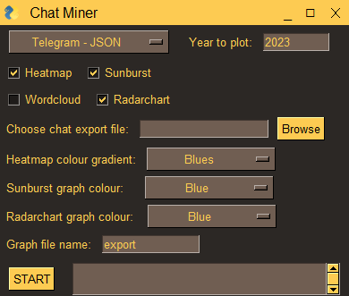

# chat-miner GUI

This is a simple GUI made for the [chat-miner](https://github.com/joweich/chat-miner) library.

It supports Telegram, Facebook Messenger, WhatsApp, Instagram, and Signal.

## 1. Download the release

Download the latest .exe release from [here](https://github.com/vactomas/chat-miner_GUI/releases)

## 2. Download chat exports

Now you need to download the export files of your chats. Guides can be found here for [WhatsApp](https://faq.whatsapp.com/1180414079177245/), [Signal](https://github.com/carderne/signal-export), [Telegram](https://telegram.org/blog/export-and-more), [Facebook Messenger](https://www.facebook.com/help/messenger-app/713635396288741), and [Instagram Chats](https://help.instagram.com/181231772500920).

## 3. Run the executable and make some choices

After running the executable, this window will appear.

<p align="center">
  
</p>

Here you can choose:
- the chat export type
- which year should be used for data extraction
- which graphs should be plotted
- the chat export file itself
- colours for different graph types
- graph file name

Only the export file itself needs to be specified, along with the year. You can leave all the remaining settings as they are.

## 4. Press start and enjoy!

After pressing the start button, the program will automatically create a folder called plots in which, it will store your graphs.

Enjoy the fun with visualizing your chats and be sure to share them with your friends. 😁

## If you are interested in contributing, running from source or building it yourself

```
git clone https://github.com/vactomas/chat-miner_GUI
cd chat-miner_GUI
pip install -r requirements.txt
```

I use pyinstaller to build the executable.

```
pyinstaller --onefile --windowed --add-data 'path-to-your-installed-modules/Lib/site-packages/wordcloud/stopwords;wordcloud/' chat_miner.py
```